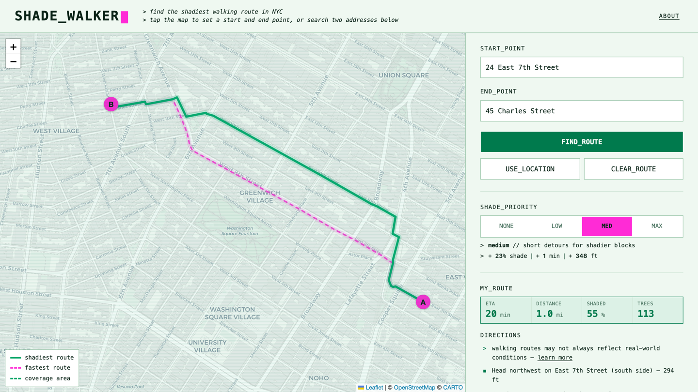

# Shade Walker

**Tree-shaded walking routes for New York City.** Pick two points and a
shade priority; get the walk that keeps you under the tree canopy — with the
routing cost of the shade (extra minutes, extra distance) shown.



Built on three public datasets: OpenStreetMap's pedestrian network, the
live NYC Tree Map, and the city's
6-inch land-cover raster for park canopy.

## By the numbers

- 488,638 routable sidewalk and path edges across all five boroughs
- ~900,000 city tree records, scored onto the side of the street they
  actually shade
- One 26 MB export; the whole city routes from ~0.7 GB of RAM
- Every request computes all four shade presets; typical full response
  ~400 ms
- ~300 backend tests, 54 unit, 13 end-to-end, zero lint warnings, CI on
  every PR
- Lighthouse 100/100/100 (accessibility / best practices / SEO); zero
  axe violations across three browser engines

## How it works

```
pipeline/   Python · OSM extract + NYC Tree Map + land-cover raster
            → per-sidewalk pedestrian graph, every edge scored for shade
            → one citywide export (~26 MB)
server/     FastAPI + igraph · loads the export into memory, serves
            /route (Dijkstra over tree-weighted costs), /geocode
            (proxy to Photon), /coverage — and the built frontend
web/        Vite + React + TypeScript + react-leaflet
```

The model choices that matter:

- **Per-sidewalk edges, not street centerlines.** Each side of a street
  is its own routable edge with its own shade score — 37.8% of NYC
  streets have ≥70% of their canopy on one side, so a single score per
  street would erase exactly the distinction this app exists for.
- **Coverage comes straight from OpenStreetMap.** Anything OSM maps as
  a pedestrian way is routable; where OSM has no sidewalk mapped, there
  is no route — the app never invents geometry.
- **Trees attach to the side they shade.** Each recorded tree is
  assigned to the block face its canopy actually reaches (96.7% of
  points attach to a clear side); park paths get area credit from the
  land-cover raster where individual records don't exist.
- **Seasonality is real.** Leaf-on/leaf-off varies by month; the same
  street scores shadier in July than April, and `/route` takes a month
  parameter.
- **One request, four routes.** Every call computes the full
  Shade_priority ladder (weights 0/5/15/40), so switching presets
  client-side is instant.

## Running it

```bash
# Python side (needs uv, which installs its own Python)
uv sync
uv run python -m pipeline.build          # full pipeline → data/export (~22 min;
                                         # fetches OSM extract, trees, raster on first run)
uv run uvicorn server.app:app --port 8000

# Frontend
cd web
npm install
npm run dev                              # dev server, proxies API to :8000
npm run build                            # production build; the FastAPI server
                                         # serves web/dist itself when present
```

Open the printed local URL and click two points on the map (or type two
addresses) to see the shadiest route alongside the plain-fastest one.
Optionally set `SOCRATA_APP_TOKEN` (a free token from
[data.cityofnewyork.us](https://data.cityofnewyork.us)) to raise the NYC
Open Data rate limit during the first fetch.

Production runs as **one process**: `uvicorn server.app:app
--no-access-log --no-server-header` serves API and frontend together
(the flags keep visitor IPs and searched locations out of logs — query
strings here are location data).

## Tests

Four tiers, all in CI except the data-dependent one:

- `uv run pytest` — pipeline + server (~300 tests), including
  route-regression goldens and a latency canary that run only where the
  real citywide export exists (they skip cleanly elsewhere)
- `npm run test:unit` — Vitest for pure logic and hooks
- `npx playwright test` — end-to-end against a committed pilot fixture:
  smoke, keyboard navigation, axe accessibility scans per app state, and
  the shade-monotonicity guarantee
- `npx tsc -b` / `npm run lint` — both clean, zero warnings

## Accessibility

Targets WCAG 2.1/2.2 AA. Last audited 2026-08-30: axe-core across five
app states in Chromium, Firefox and WebKit (zero violations), full
keyboard operation including the address autocomplete (ARIA combobox),
320px reflow, `prefers-reduced-motion`, and forced-colors. Automated
checks are supplemented by manual VoiceOver passes. Known limitation:
map interaction is pointer-first; every routing function is equally
available through the labeled address fields.

## Honest limitations

- Shade means **tree** shade — building shadows aren't modeled (yet).
- OSM's volunteer-built sidewalk coverage is uneven; routing is thinnest
  in parts of the Bronx and Staten Island (~70% routable area vs ~83%
  elsewhere). Mapping a missing sidewalk on OSM fixes the app within a
  month (data refreshes monthly).
- The land-cover raster is from 2021, so recently planted trees are
  undercounted.

## Data & attribution

Map data © [OpenStreetMap contributors](https://www.openstreetmap.org/copyright)
(ODbL). Tree data: [NYC Open Data](https://opendata.cityofnewyork.us/) /
NYC Parks Forestry Tree Points. Basemap tiles by
[CARTO](https://carto.com/attributions). Geocoding by
[Photon](https://photon.komoot.io/) (komoot). The `data/` directory is
fully regenerable from these sources and never committed.

## License

Copyright (c) 2026 camrynobscura.
[AGPL-3.0](LICENSE): use it, learn from it, build on it — but anything
built on it, including a hosted version, must share its source under the
same terms. The data sources above carry their own licenses.
